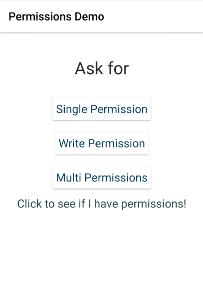

[](https://www.npmjs.com/package/nativescript-permissions)
[](https://www.npmjs.com/package/nativescript-permissions)
[](https://www.npmjs.com/package/nativescript-permissions)

# nativescript-permissions
A NativeScript plugin to deal with Android permissions (mainly for API 23+/Android 6+)

Now has support for AndroidX (NativeScript 6.0) and still works all the way back to NativeScript 2.0

Has a dummy library for iOS so that if ask it for any android permissions; it will resolve every one of them as true...

This plugin also has built in support for the Android `WRITE_SETTINGS` & `SYSTEM_ALERT_WINDOW` permission that has a completely different permission path.


## License

This is released under the MIT License, meaning you are free to include this in any type of program -- However for entities that need a support contract, changes, enhancements and/or a commercial license please contact me at [http://nativescript.tools](http://nativescript.tools).

I also do contract work; so if you have a module you want built for NativeScript (or any other software projects) feel free to contact me [nathan@master-technology.com](mailto://nathan@master-technology.com).

[](https://www.paypal.com/cgi-bin/webscr?cmd=_donations&business=HN8DDMWVGBNQL&lc=US&item_name=Nathanael%20Anderson&item_number=nativescript%2dpermissions&no_note=1&no_shipping=1&currency_code=USD&bn=PP%2dDonationsBF%3ax%3aNonHosted)
[](https://www.patreon.com/NathanaelA)


## Sample Snapshot


You can see me do something that requests permissions; then I deny the permissions.  The second time through you will see the **toast** about why I think I need these permissions; then I finally accept them.

## Requirements
This requires NativeScript 2.0 or greater

## Installation 

```
tns plugin add nativescript-permissions
```

## Usage

To use the module you just `require()` it:

```js
const permissions = require( "nativescript-permissions" );
```


## You ask, how exactly does this help?
This wraps up the entire Android 6 permissions system into a nice easy to use promise. In addition, you can also have multiple permissions pending and each one will resolve properly.

```js
const permissions = require('nativescript-permissions');
permissions.requestPermission(android.Manifest.permission.READ_CONTACTS, "I need these permissions because I'm cool")
  .then( () => {
     console.log("Woo Hoo, I have the power!");
  })
  .catch( () => {
     console.log("Uh oh, no permissions - plan B time!");
  });
```

The explanation won't be showed unless they have denied the request once.

## Why use this?
This simplifies the checks and allows you to have two courses of action depending on the results of the permission request.

## API
### Functions
#### permissions.hasPermission(permissionName);
- **permissionName** - The permission you are requesting.
- **returns** Boolean - true or false

#### permissions.hasPermissions(\[permissionName, permissionName, ...]);
- **permissionName(s)** - The permission(s) you are requesting.
- **returns** Object

```js
  {
    checked: 0, // Total number of permissions checked.
    success: 0, // Number of permissions you have
    failed: 0,  // Number of permissions you do NOT have
    permissionName(s): false, // Each permission with it status
  }
```


#### \<Promise> = permissions.requestPermission(permissionName, explanation);
- **\<Promise>** - the **.then()** path will be permission granted, the **.catch()** will be permission denied
- **permissionName** - The permission you are requesting - REQUIRED
- **explanation** - This can be either a string that will show as a toast at the top of the screen **or** this can be a function callback that will be called so that you can show whatever you want. - OPTIONAL


#### \<Promise> = permissions.requestPermissions(\[permissionName, permissionName, ...], explanation);
- **\<Promise>** - the **.then()** path will mean ALL permissions were granted the **.catch()** means some or all permission were denied
- **permissionName(s)** - The ARRAY of permissions you are requesting - REQUIRED
- **explanation** - This can be either a string that will show as a toast at the top of the screen **or** this can be a function callback that will be called so that you can show whatever you want. - OPTIONAL

The granted or failed promise will return an object keyed to your permissionName Like so:

```js
{
  "contact": true,
  "camera": false
}
```

If you are granted and receive all permissions, then it will resolve with the granted permission promise.  If you failed to get even one of the permissions then it will then resolve the failed/catch promise; then you can use the object list to determine which permission(s) you failed and were granted by the end user.
So in the above example object, this would have been resolved to the failed promise because you failed to get the camera access.

## Notes
Because this uses support.v4 (or androidx); this code works on ALL versions that nativescript supports currently.  So you can start coding this into your app at this point and your app should work on everything.

You still need to put all the permissions you need in the manifest as usual, even on Android 6.    On Android 6 you ALSO must ask the user for permissions each time you go to do anything that needs a "dangerous" permission.  You can see all the permissions at [https://developer.android.com/reference/android/Manifest.permission.html](https://developer.android.com/reference/android/Manifest.permission.html).

Warning: even though the application has been granted permissions once, does NOT mean the app still has permissions; the user can revoke the "dangerous" permissions even while the app is running.  So again YOU MUST use requestPermissions each time.  If the app still has the permissions you will be granted it immediately without the user seeing a dialog.

In NativeScript when using the permissions names/strings in your code; they are accessed as: android.**Manifest**.permission.PERMISSION_NAME rather than the android.permission.PERMISSION_NAME that you would put inside the manifest and are listed on the Android documentation site listed above.

The Android manifest that you need to put the permissions in also is located at `/app/App_Resources/Android/main/res/AndroidManifest.xml`

## Special Permissions
If you need the Android `WRITE_SETTINGS` or `SYSTEM_ALERT_WINDOW` permission, and any other permissions; you need to make TWO separate permission calls.  The `WRITE_SETTINGS` and `SYSTEM_ALERT_WINDOW` permission must be requested by itself, as they have a different permission path to make it work...
